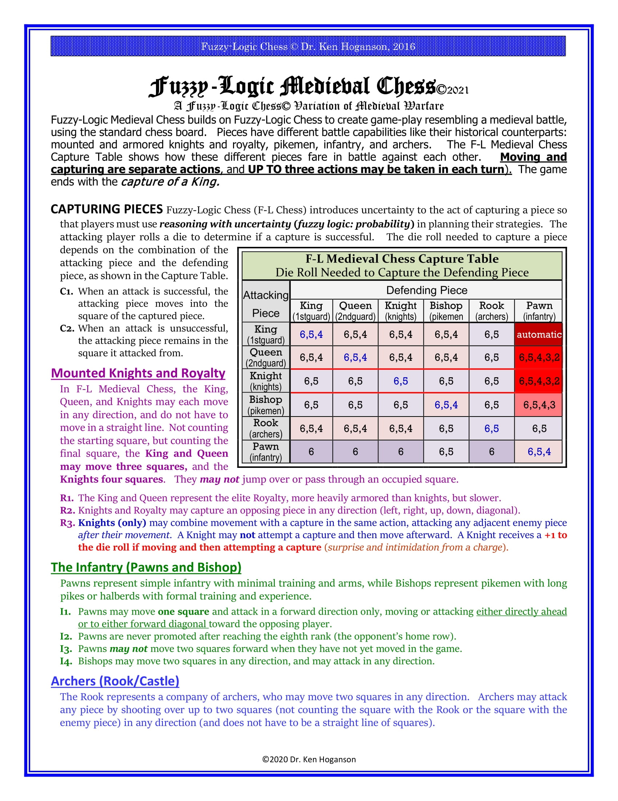
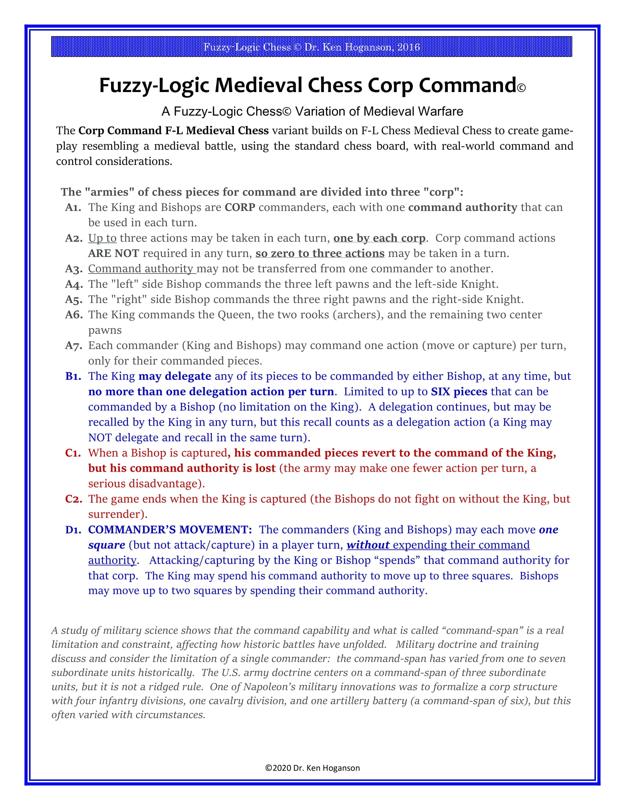

# Fuzzy Logic Chess Program
Written for KSU Senior Project 2021

The purpose of this project is to create a chess playing application that runs on a variant of the Fuzzy-Logic ruleset called Fuzzy-Logic Medieval Chess

## The Rules

